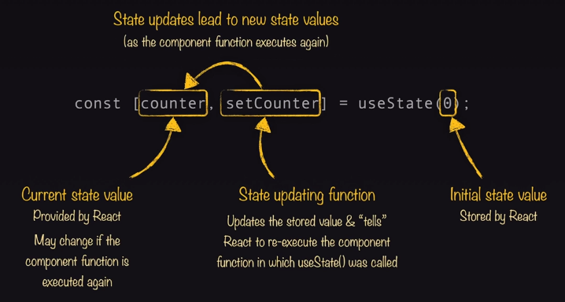
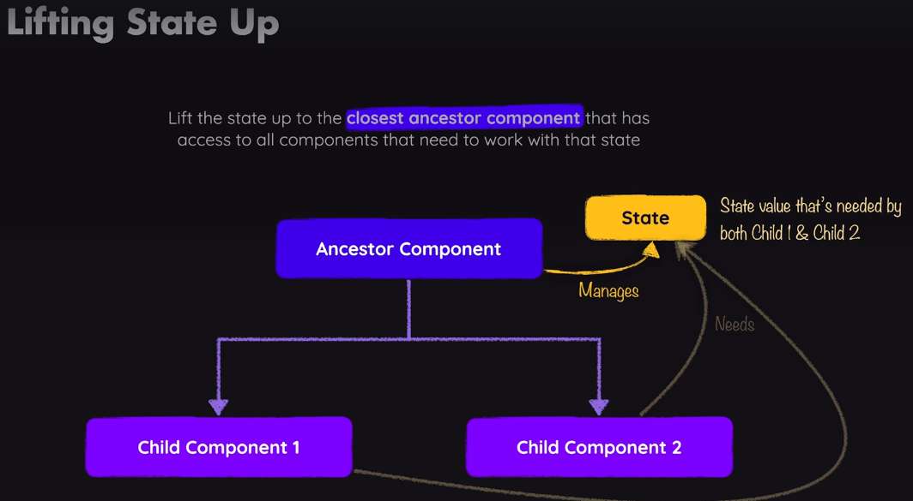
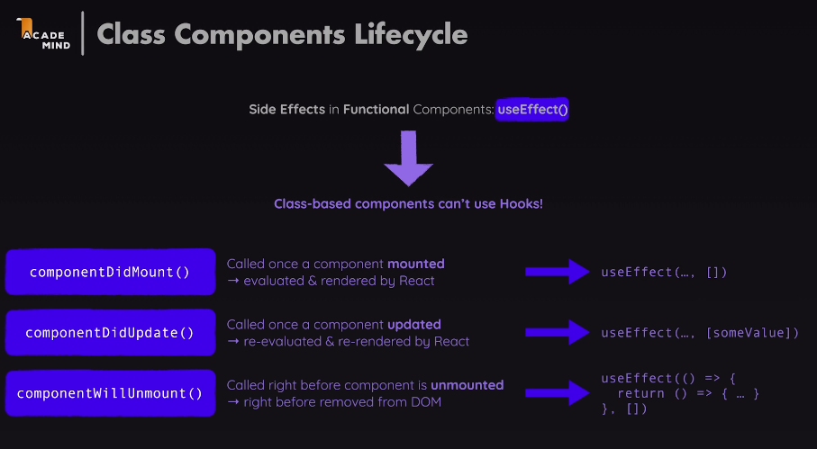

# react

- React project come with a build process that transforms jsxcode (behind the scene) to code that does work in the browser.
- component name should be capital letter and give a render object
- now under the hood instead of virtual dom now react use fiver.
[react fiber](https://github.com/acdlite/react-fiber-architecture)
- {} jsx in here if statements, for-loops , function definitons and other block statements are not allowed here. only expression that directly produce the value.
- [Import and Export](https://www.geeksforgeeks.org/reactjs-importing-exporting/)
- [spread and rest operator](https://www.freecodecamp.org/news/javascript-spread-and-rest-operators/)
- [two-way-binding](https://stackoverflow.com/questions/77777432/what-is-two-way-binding-in-react)
- [derived state](https://stackoverflow.com/questions/58288286/what-is-derived-state-in-react-and-why-is-it-important)
- [convert string to int multiple methods ](https://www.freecodecamp.org/news/how-to-convert-a-string-to-a-number-in-javascript/)
- [css module](https://github.com/css-modules/css-modules)
- [tagged templates](https://developer.mozilla.org/en-US/docs/Web/JavaScript/Reference/Template_literals#tagged_templates)
- [strict mode](https://www.geeksforgeeks.org/what-is-strictmode-in-react/)
- [Html input attributes](https://www.w3schools.com/html/html_form_attributes.asp)
- [useRef current methods article](https://stackoverflow.com/questions/73964594/react-how-many-methods-have-ref-current)
- [useRef explained](https://www.dhiwise.com/post/exploring-useref-a-must-know-hook-for-every-react-developer)
- [useImperativeHandle hook](https://medium.com/@nadeem.ahmad.na/understanding-useimperativehandle-a-powerful-hook-for-react-development-46063e44e52a)
- [create portal 146 video udemy](https://react.dev/reference/react-dom/createPortal)
- [Prop drilling ](https://www.freecodecamp.org/news/prop-drilling-in-react-explained-with-examples/)refers to the process of passing down props through multiple layers of components, even when some of those components do not directly use the props.

- [contextapi](https://www.freecodecamp.org/news/context-api-in-react/).The default value set when creating the context is only used if a component that was not wrapped by the provider component tries to access the context value.
- [useReducer](https://dev.to/spukas/3-reasons-to-usereducer-over-usestate-43ad)
- [react 19 feature](https://www.freecodecamp.org/news/new-react-19-features/)
- [usememo vs memo](https://www.geeksforgeeks.org/difference-between-react-memo-and-usememo-in-react/)
- [usecallback vs usememo](https://www.freecodecamp.org/news/difference-between-usememo-and-usecallback-hooks/)
- [html for attribute](https://www.geeksforgeeks.org/html-label-for-attribute/)
# optional chaining operator
- [useNavigate](https://www.dhiwise.com/post/understand-error-usehistory-not-found-in-react-router-dom)


In the code snippet you provided:

```javascript
const copyPasswordToClipboard = useCallback(() => {
    passwordRef.current?.select();
    passwordRef.current?.setSelectionRange(0, 999);
    window.navigator.clipboard.writeText(password)
  }, [password])
```

The question mark (`?`) is used as part of the optional chaining operator (`?.`). This operator is a new feature introduced in ECMAScript 2020 (ES11) and is used to avoid errors when accessing properties or calling methods on potentially null or undefined values.

Let's break down how the optional chaining operator is used in your code:

1. `passwordRef.current?.select();`: This line attempts to call the `select()` method on the `current` property of the `passwordRef` object. The `?.` operator ensures that if `passwordRef.current` is null or undefined, the `select()` method will not be called, avoiding a potential error.

2. `passwordRef.current?.setSelectionRange(0, 999);`: Similarly, this line attempts to call the `setSelectionRange()` method on the `current` property of `passwordRef`. Again, the `?.` operator prevents the method call if `passwordRef.current` is null or undefined.

3. `window.navigator.clipboard.writeText(password)`: This line writes the `password` to the clipboard using the `writeText()` method of `navigator.clipboard`. Note that this line does not use optional chaining because `window.navigator.clipboard` is expected to be available in a modern browser environment.

In summary, the question mark (`?`) in your code helps prevent errors by checking if an object or property exists before attempting to access or use it. If the object or property is null or undefined, the operation is skipped, avoiding potential runtime errors.

### Rules of Hooks

1. **Only Call Hooks at the Top Level**
   - **Do not call Hooks inside loops, conditions, or nested functions.**

2. **Only Call Hooks from React Functions**
   - **Do not call hooks from regular JavaScript functions.**
   

# usestate



# Lift-State




# classBased components cannot use hooks.



# hooks explaination


Sure, I'll explain when to use `useEffect`, `useRef`, and `useCallback` hooks in React, along with examples for each.

1. [useEffect](https://gurindernarang.medium.com/side-effect-useeffect-in-react-2dc6cdf0b9c5#:~:text=In%20React%2C%20%E2%80%9Cside%20effects%E2%80%9D,interactions%20with%20the%20outside%20world.):
   The `useEffect` hook is used to perform side effects in a functional component. Side effects can include data fetching, subscriptions, or manually changing the DOM.

   
2. [useRef](https://www.w3schools.com/react/react_useref.asp) is a React hook that provides a way to persist mutable values across renders without causing re-renders when the value changes. Unlike state variables (`useState`), changes to a `useRef` value do not trigger re-renders of components.

 **Storing mutable values without triggering re-renders:** Since changes to `useRef` values don't cause re-renders, you can use it to store values that you don't want to trigger component updates. This is useful for values that need to persist across renders but don't affect the UI.

  
3. `useCallback`:
   The `useCallback` hook is used to memoize functions to avoid unnecessary re-creations, especially when passing functions as props to child components.

  
# when to use curly double curly braces

- whenever passing an object in jsx.

Double curly braces (`{{ }}`) are used in React when you want to pass an object as a value for a prop or attribute that expects an object. This pattern is commonly seen in the `style` attribute for applying inline CSS styles, as demonstrated in the previous example.

Here are some situations where you would use double curly braces in React:

1. **Inline Styles (`style` attribute):** When applying inline styles to React components, you use double curly braces to pass an object containing CSS properties and their values. For example:
   ```jsx
   <div style={{ color: 'red', fontSize: '16px' }}>Styled Text</div>
   ```

2. **Event Handlers:** When passing an object as an argument to event handlers, such as `onClick`, `onChange`, etc., you use double curly braces. For instance:
   ```jsx
   <button onClick={() => handleClick({ id: 1, name: 'Button' })}>Click me</button>
   ```

3. **Passing Objects as Props:** If you have a component that expects an object as a prop, you use double curly braces to pass the object inline. For example:
   ```jsx
   <ChildComponent data={{ key: 'value', number: 123 }} />
   ```

4. **Setting State with Objects:** When updating state in React and passing an object to `setState`, you use double curly braces. For instance:
   ```jsx
   const [state, setState] = useState({ count: 0 });
   // Update state with an object using double curly braces
   setState({ count: state.count + 1 });
   ```

5. **Destructuring Props or State:** In functional components, when destructuring props or state, you might use double curly braces. For example:
   ```jsx
   const { prop1, prop2 } = props; // Destructuring props
   const { state1, state2 } = useState(initialState); // Destructuring state
   ```

In summary, double curly braces are used in React to indicate that you are passing an object literal as a value. This pattern is particularly common when dealing with inline styles, event handlers, passing objects as props, updating state with objects, and destructuring props or state.

# important points

- [conditional rendering](https://react.dev/learn/conditional-rendering)
- every event takes a function as input.
- In button onclick property takes function as a input.
- React router [navlink & Link](https://www.geeksforgeeks.org/link-and-navlink-components-in-react-router-dom/)

       `NavLink` and `Link` are components provided by React Router, a popular routing library for React applications. They serve similar purposes but have some differences in functionality:

- **Link**: This is a basic component used for declarative navigation in React Router. It's similar to an `<a>` tag in HTML but optimized for React Router. You use `Link` to navigate between different routes in your application. For example:
  ```jsx
  import { Link } from 'react-router-dom';

  const MyComponent = () => {
    return (
      <div>
        <Link to="/about">About</Link>
        <Link to="/contact">Contact</Link>
      </div>
    );
  };
  ```

- **NavLink**: This is a special version of `Link` that is used for navigation with additional features like styling the active link based on the current URL. `NavLink` allows you to specify CSS classes or styles that should be applied to the link when it matches the current URL. It's handy for creating navigation menus where you want to highlight the active link. Here's an example:
  ```jsx
  import { NavLink } from 'react-router-dom';

  const MyNavBar = () => {
    return (
      <nav>
        <ul>
          <li><NavLink to="/" exact activeClassName="active">Home</NavLink></li>
          <li><NavLink to="/about" activeClassName="active">About</NavLink></li>
          <li><NavLink to="/contact" activeClassName="active">Contact</NavLink></li>
        </ul>
      </nav>
    );
  };
  ```

   In summary, `Link` is a basic component for navigation, while `NavLink` adds extra features like styling based on the active route. Use `Link` for simple navigation needs and `NavLink` when you want to style active links in your navigation menu.

- [useid hook](https://react.dev/reference/react/useId)

- don't use array index as keys bcz it degrade the react performance.


- [react loader](https://reactrouter.com/en/main/route/loader)
- when you want to take data from local storage convert it into json and when u are saving data in local storage store it as string bcz it store data in string data type.means you have to parse in json when try to get and parse it in string when trying to store it.

# Redux, state and action are fundamental concepts that work together to manage your application's data:

* **State:**  This represents the current condition of your application at any given point in time. It's essentially a JavaScript object tree that stores all the data your application needs to function.  Imagine it as a snapshot of all the relevant information displayed on the screen and behind the scenes.

* **Action:**  This describes an event that happened in your application. It's a plain JavaScript object that signals the need for a state change.  Think of it as a message indicating something happened (like a button press, data fetched) and potentially including additional details (like the data itself). Actions typically have two key properties:
    * **type:**  A string that uniquely identifies the type of action (e.g., "userLoggedIn", "itemAddedToCart").
    * **payload (optional):**  Additional data associated with the action, if needed (e.g., the username for "userLoggedIn" or the item details for "itemAddedToCart").

* In Redux, an action is a plain JavaScript object that represents an intention to change the store’s state. Action objects must have a type property with a user-defined string value that describes the action being taken.

* Optional properties can be added to the action object. One common property added is conventionally called payload, which is used to supply data necessary to perform the desired action.    

Here's how they work together:

1. **Something happens in your application:** A user interacts with the UI (clicks a button, submits a form), or some asynchronous event occurs (data fetched from an API).
2. **An action is dispatched:**  The UI component or event handler creates an action object describing what happened. This action is then "dispatched" to the Redux store.
3. **Reducers update the state:** The Redux store holds the current state and a set of reducer functions. Each reducer is a pure function that takes the previous state and the dispatched action as arguments. Based on the action type, the reducer updates a specific part of the state immutably (without modifying the original state object) and returns a new state object.
4. **Components re-render:** The store notifies any connected components that the state has changed. These components re-render themselves based on the new state, reflecting the changes in the UI.

This unidirectional data flow (action -> reducer -> state update -> UI re-render) is a core principle of Redux, making it predictable and easier to debug your application's state changes.

- [react-redux](https://www.freecodecamp.org/news/redux-and-redux-toolkit-for-beginners/)

- [redux toolkit docs](https://redux-toolkit.js.org/api/createSlice)

- [onsubmit](https://www.geeksforgeeks.org/react-onsubmit-event/) also takes event as input.
- [onchange](https://www.geeksforgeeks.org/react-onchange-event/)
- [map in redux use key concept](https://legacy.reactjs.org/docs/lists-and-keys.html)
- if you created the project with vite then there is diffrent method to access the env and same for nextjs, create react also.

- A collection in Appwrite is a logical grouping of documents, similar to a table in SQL or a collection in MongoDB.
Collections allow you to define a schema for the data they store, specifying fields and their data types.

- [forward ref](https://react.dev/reference/react/forwardRef) but we should not use it more bcz it directly manupulate the dom.

# `Ref` and `ForwardRef` are both related to handling references to React elements, but they serve different purposes.

1. **`Ref`**:
   - A `ref` is a way to reference a DOM element or a React component instance directly.
   - It's commonly used for accessing DOM elements or for managing focus, selection, or animations imperatively.
   - Example:

     ```jsx
     import React, { useRef, useEffect } from 'react';

     const MyComponent = () => {
       const inputRef = useRef(null);

       useEffect(() => {
         inputRef.current.focus();
       }, []);

       return <input ref={inputRef} />;
     };

     export default MyComponent;
     ```

   In this example, `inputRef` is a `ref` that allows us to focus on the input element imperatively using `inputRef.current.focus()`.

2. **`ForwardRef`**:

 Yes, exactly! The `forwardRef()` is used to allow a **parent component** to pass its **ref** to a **child component**. This lets the parent access or manipulate the **child component's DOM element** directly, even though the parent doesn't render the DOM element itself.

 So in simple terms, `forwardRef()` "forwards" the **parent's ref** down to the **child's DOM element**. 

 This is useful when you want to:
 - Focus on an input or button from the parent.
 - Trigger a scroll or animation in a child component from the parent.
 - Generally interact with a child's DOM element directly from the parent.

You're on the right track! Let me clarify what's happening:

Using below useimperativeHandle code to understand the workflow of forwardref.

### How `useRef` and `forwardRef` Work Together:

When you pass `inputRef` from the parent component to the child component (`CustomInput`) using `forwardRef`, you are essentially linking the parent’s `ref` to something inside the child component. In this case, the child component decides what the parent can access through that `ref`. 

### Here's a Breakdown:

1. **`inputRef` in ParentComponent**:
   - `useRef()` creates a reference object called `inputRef` in the parent component. Initially, this `inputRef.current` is `null`.

2. **Passing `inputRef` to `CustomInput`**:
   - You pass `inputRef` to `CustomInput` through `ref={inputRef}`. This connects the parent's `ref` to the child component.

3. **Using `forwardRef` and `useImperativeHandle` in ChildComponent**:
   - Inside the `CustomInput` component, you use `forwardRef` to accept the `ref` from the parent.
   - With `useImperativeHandle`, you control what the parent can access through this ref. In this case, you expose two methods: `focusInput()` and `clearInput()`.

   ```jsx
   useImperativeHandle(ref, () => ({
     focusInput: () => {
       inputRef.current.focus();
     },
     clearInput: () => {
       inputRef.current.value = "";
     },
   }));
   ```

4. **Parent Accessing Custom Methods**:
   - Once `CustomInput` is rendered, the parent’s `inputRef` is now pointing to the object returned by `useImperativeHandle` in the child component. This means that `inputRef.current` is no longer just the DOM element itself; it's an object containing the `focusInput` and `clearInput` methods that you defined.
   
   - When you call `inputRef.current.focusInput()` in the parent, it triggers the `focusInput` method that was defined in the child. Similarly, `inputRef.current.clearInput()` triggers the method to clear the input.

### Simplified View:

- **Parent's `ref` (`inputRef`)** gets passed to the **child** (`CustomInput`).
- In the **child component**, `useImperativeHandle` exposes **custom methods** (`focusInput` and `clearInput`).
- The **parent component** can now use `inputRef.current.focusInput()` and `inputRef.current.clearInput()` because these methods were exposed by the child.

### Key Idea:
Yes, the `inputRef` is **referenced with the child component**, and the parent is able to access the custom properties or methods (like `focusInput` and `clearInput`) defined in the child through `useImperativeHandle`.

Think of `useImperativeHandle` as a way for the child to **customize what the parent can do** with the ref, rather than just allowing the parent to directly manipulate the child’s DOM element.

3. **`useimperativeHandle`**:

`useImperativeHandle` in React is a hook that allows you to customize the values exposed to the parent component when using `ref`. In simple terms, it lets you control what functions or properties are made available to the parent when it interacts with the child component's ref.

### When to use it:
You use `useImperativeHandle` when you want the parent component to have access to specific methods or properties inside the child component, rather than directly interacting with the DOM element.

### Example (Simple Use Case):
Imagine you have a child component that contains an input field. You want to let the parent component trigger custom functions like **clearing the input field** or **focusing on it**.

#### Child Component:

```jsx
import React, { useRef, useImperativeHandle, forwardRef } from "react";

const CustomInput = forwardRef((props, ref) => {
  const inputRef = useRef();

  // Custom functions exposed to the parent
  useImperativeHandle(ref, () => ({
    focusInput: () => {
      inputRef.current.focus();
    },
    clearInput: () => {
      inputRef.current.value = "";
    }
  }));

  return <input ref={inputRef} />;
});

export default CustomInput;
```

#### Parent Component:

```jsx
import React, { useRef } from "react";
import CustomInput from "./CustomInput";

function ParentComponent() {
  const inputRef = useRef();

  return (
    <div>
      <CustomInput ref={inputRef} />
      <button onClick={() => inputRef.current.focusInput()}>
        Focus Input
      </button>
      <button onClick={() => inputRef.current.clearInput()}>
        Clear Input
      </button>
    </div>
  );
}

export default ParentComponent;
```

### How it works:
1. **`CustomInput` Component**:
   - Inside `CustomInput`, we use `useImperativeHandle` to define the methods that will be exposed to the parent (`focusInput` and `clearInput`).
   - The `inputRef` is still used to refer to the actual input field DOM element, but the parent component will interact with the exposed methods instead of directly with the input element.

2. **`ParentComponent`**:
   - The `ref` is created using `useRef` and passed to `CustomInput`.
   - Now, instead of directly accessing the input field, the parent can call the `focusInput()` and `clearInput()` methods on the `CustomInput` ref.

### Simple Explanation:
`useImperativeHandle` lets you **control what the parent component can do** with the child's ref. Instead of just giving the parent access to the DOM element, you expose specific functions like `focusInput()` or `clearInput()`, allowing the parent to interact with the child in a more controlled way.

# Closer Look: public/ vs assets/ for Image Storage

The public/ Folder
As shown in the previous lecture you can store images in the public/ folder and then directly reference them from inside your index.html or index.css files.

The reason for that is that images (or, in general: files) stored in public/ are made publicly available by the underlying project development server & build process. Just like index.html, those files can directly be visited from inside the browser and can therefore also be requested by other files.

If you try loading localhost:5173/some-image.jpg, you'll be able to see that image (if it exists in the public/ folder, of course).

The src/assets/ Folder
You can also store images in the src/assets/ folder (or, actually, anywhere in the src folder).

So what's the difference compared to public/?

Any files (of any format) stored in src (or subfolders like src/assets/) are not made available to the public. They can't be accessed by website visitors. If you try loading localhost:5173/src/assets/some-image.jpg, you'll get an error.

Instead, files stored in src/ (and subfolders) can be used in your code files. Images imported into code files are then picked up by the underlying build process, potentially optimized, and kind of "injected" into the public/ folder right before serving the website. Links to those images are automatically generated and used in the places where you referenced the imported images.

Which Folder Should You Use?
You should use the public/ folder for any images that should not be handled by the build process and that should be generally available. Good candidates are images used directly in the index.html file or favicons.

On the other hand, images that are used inside of components should typically be stored in the src/ folder (e.g., in src/assets/).


# Understanding **when to use the `useState` hook** is key to building dynamic and reactive components in React. Here's a breakdown of typical situations where you should use `useState`:

### 1. **Storing User Inputs or Selections**:
Whenever you need to track and update user inputs (such as text inputs, selections, or form data), `useState` is the way to go.

#### Example: Text Input
```jsx
const [name, setName] = useState("");

<input
  type="text"
  value={name}
  onChange={(e) => setName(e.target.value)}
/>
```
- **When to use `useState`**: Any time you need to remember the value entered by the user (e.g., for form submissions or conditional rendering).

### 2. **Toggling Values (Booleans)**:
`useState` is perfect for toggling values like `true` or `false`. This is commonly used for handling things like modals, dropdowns, dark mode toggling, etc.

#### Example: Toggle Modal Visibility
```jsx
const [isModalOpen, setIsModalOpen] = useState(false);

<button onClick={() => setIsModalOpen(!isModalOpen)}>
  {isModalOpen ? "Close Modal" : "Open Modal"}
</button>

{isModalOpen && <Modal />}
```
- **When to use `useState`**: When you need to keep track of a simple state like whether something is visible or hidden, active or inactive, etc.

### 3. **Managing Form Data**:
When you're working with a form that has multiple fields (like a login or registration form), `useState` can manage the state of each field.

#### Example: Login Form
```jsx
const [formData, setFormData] = useState({ username: '', password: '' });

const handleChange = (e) => {
  const { name, value } = e.target;
  setFormData({ ...formData, [name]: value });
};

<input name="username" value={formData.username} onChange={handleChange} />
<input name="password" type="password" value={formData.password} onChange={handleChange} />
```
- **When to use `useState`**: Use it to keep track of complex objects like form data, where each field needs to be updated individually.

### 4. **Tracking Progress or Steps**:
If you're building something like a quiz, progress bar, or multi-step form, you'll often need `useState` to keep track of the current step or question.

#### Example: Quiz Question Tracker
```jsx
const [currentQuestion, setCurrentQuestion] = useState(0);

<button onClick={() => setCurrentQuestion(currentQuestion + 1)}>Next Question</button>
```
- **When to use `useState`**: Use it to manage progress in applications that rely on moving through a series of steps or questions.

### 5. **Handling Async Data**:
When you're working with data from an API or some asynchronous process, `useState` is used to track the state of that data as it loads and updates.

#### Example: Fetching Data
```jsx
const [data, setData] = useState(null);
const [loading, setLoading] = useState(true);

useEffect(() => {
  fetchData().then(response => {
    setData(response);
    setLoading(false);
  });
}, []);

return loading ? <p>Loading...</p> : <div>{data}</div>;
```
- **When to use `useState`**: When fetching data from an API or any async operation, use `useState` to store the result and manage loading states.

### 6. **Storing Component-Specific State**:
If you have some internal state that belongs to the component itself and doesn’t need to be shared with other components, use `useState`.

#### Example: Accordion Component
```jsx
const [isOpen, setIsOpen] = useState(false);

<button onClick={() => setIsOpen(!isOpen)}>
  {isOpen ? "Hide Content" : "Show Content"}
</button>
{isOpen && <div>Accordion Content</div>}
```
- **When to use `useState`**: If the state is local to a single component and doesn't need to be passed down or shared.

### 7. **Dynamic CSS Changes**:
You can use `useState` to handle dynamic CSS class changes, such as changing the style of a button after it's clicked.

#### Example: Button State Change
```jsx
const [isClicked, setIsClicked] = useState(false);

<button
  className={isClicked ? "clicked" : ""}
  onClick={() => setIsClicked(true)}
>
  Click Me!
</button>
```
- **When to use `useState`**: For changing classes or styles conditionally based on user interaction.

### When **NOT** to Use `useState`:
- **Static Data**: If the data never changes, you don't need `useState`. Use regular variables or constants.
- **Derived Data**: If a piece of state can be calculated from existing state or props, you may not need a separate `useState`. In that case, compute it within the component's body.

### Summary of When to Use `useState`:
- To **store and update data** that changes over time (e.g., user inputs, quiz answers).
- To handle **toggles** and **visibility** of UI elements.
- To manage **forms** and **user input**.
- To keep track of **async data** loading (like from APIs).
- To handle **dynamic styling** or CSS classes.
- Whenever your component needs to **re-render** based on some value change.

Let me know if you need examples related to specific cases you're working on!

# disable option available in many html element 

In HTML, the `disabled` property can be applied to a variety of form-related elements to prevent user interaction. Here's a list of elements that support the `disabled` attribute:

1. **`<button>`**: Disables the button so it cannot be clicked.
2. **`<input>`**: Disables various input types (`text`, `checkbox`, `radio`, `password`, `file`, etc.).
3. **`<select>`**: Disables the dropdown menu, preventing users from selecting any options.
4. **`<textarea>`**: Disables the text area, preventing users from entering or modifying text.
5. **`<fieldset>`**: Disables all form controls within the fieldset (grouping of form elements).
6. **`<optgroup>`**: Disables a group of options inside a `<select>` element.
7. **`<option>`**: Disables a specific option inside a `<select>` dropdown.

These are the main elements in HTML that can have the `disabled` attribute, ensuring they are non-interactive when the attribute is present.cd 

# In **React Router DOM**, there are two common ways to set up routing in your application: **`BrowserRouter`** and **`createBrowserRouter`**. Both are used to manage navigation and handle routing in a React application, but they are used in different ways and have distinct use cases.

### **1. `BrowserRouter`** (Traditional Approach)
`BrowserRouter` is a **component** that wraps your entire application and provides the routing context to all nested components.

- **Used with**: React Router v5 and earlier.
- **How it works**: It is a declarative approach where you define your routes inside the JSX by nesting `Route` components under `BrowserRouter`.
- **When to use**: You use `BrowserRouter` when your routing setup is declarative, and you want to define routes inside JSX, typically in the component tree.
  
#### Example:
```jsx
import React from 'react';
import { BrowserRouter, Route, Switch } from 'react-router-dom';

function App() {
  return (
    <BrowserRouter>
      <Switch>
        <Route path="/" exact>
          <Home />
        </Route>
        <Route path="/about">
          <About />
        </Route>
      </Switch>
    </BrowserRouter>
  );
}
```

Here, `BrowserRouter` wraps the entire routing setup. It uses the HTML5 history API to manage navigation without reloading the page.

### **2. `createBrowserRouter`** (React Router v6+)
`createBrowserRouter` is a **new API** introduced in React Router v6, part of a more **programmatic routing approach**. This method allows you to define your routes in a **separate configuration** rather than directly in the component tree.

- **Used with**: React Router v6 and later.
- **How it works**: You define a router configuration object, and then you pass that configuration to a Router component (such as `RouterProvider`).
- **When to use**: You use `createBrowserRouter` in the new **React Router v6** (or later) for **more explicit routing setup**. This approach is more flexible and allows for additional features like data loading and error boundaries.

#### Example:
```jsx
import React from 'react';
import ReactDOM from 'react-dom/client';
import { createBrowserRouter, RouterProvider } from 'react-router-dom';

const router = createBrowserRouter([
  {
    path: "/",
    element: <Home />,
  },
  {
    path: "/about",
    element: <About />,
  },
]);

function App() {
  return <RouterProvider router={router} />;
}

const root = ReactDOM.createRoot(document.getElementById('root'));
root.render(<App />);
```

In this case, `createBrowserRouter` is used to define the routes in a configuration array, which is then passed into the `RouterProvider` to handle navigation. This approach is part of React Router v6's **new routing system** that simplifies routing logic and makes it more scalable.

### **Key Differences**:

| Feature                          | `BrowserRouter` (v5)                             | `createBrowserRouter` (v6+)                   |
|-----------------------------------|-------------------------------------------------|---------------------------------------------|
| **Type**                          | Component-based (declarative)                   | Programmatic approach (configuration-based) |
| **Usage**                         | Used by wrapping routes inside JSX              | Used by creating a router configuration and passing it to `RouterProvider` |
| **History API**                   | Uses HTML5 History API                          | Uses HTML5 History API                      |
| **Dynamic Route Configuration**   | Not directly supported                          | Supports more dynamic configurations, such as data loading and error boundaries |
| **React Router Version**          | Available in React Router v5 and earlier        | Introduced in React Router v6 and above      |
| **Flexibility**                   | More rigid (nested Routes inside JSX)          | More flexible (can handle complex setups)   |
| **Use Case**                       | Best for simple or small applications           | Best for more complex, scalable apps with advanced routing features |

### **When to Use Each**:
- **Use `BrowserRouter`** when:
  - You're using React Router v5 (or earlier) or need a simple, declarative routing setup.
  - You want to define routes directly in the JSX.
  
- **Use `createBrowserRouter`** when:
  - You're using React Router v6+ and want to leverage its newer features like **data loading**, **error boundaries**, or **nested routes** that are configured outside of the JSX.
  - You need more flexibility and a better separation of concerns between route logic and component rendering.

In summary, **`BrowserRouter`** is a simpler, older way of configuring routes, while **`createBrowserRouter`** offers more advanced configuration options in React Router v6+ for larger applications.


# outlet react 

- The React Outlet component acts as a designated area within a parent route where child routes can be rendered. It essentially creates a placeholder for the content of child routes to be injected into the parent route's layout. 

### **Understanding `<Outlet />` in React Router**

The `<Outlet />` component in React Router plays a crucial role when creating nested routes. It's a placeholder where child route components will be rendered. Let’s dive into its use case and relationship with React Router.

---

### **Key Concepts:**

1. **Parent-Child Route Relationship:**
   - In React Router, routes can be nested to create a hierarchical structure. This allows you to define a layout at a higher level (parent route) and render different content based on the nested route (child route).
   - The parent route defines a common structure (like a layout or a template), and the child routes represent different sections or views within that structure.

2. **Rendering Nested Routes with `<Outlet />`:**
   - When you define nested routes, you need a way to specify where the child components should be rendered inside the parent component. This is where `<Outlet />` comes into play.
   - It serves as a placeholder within the parent component where the matched child route's component will be inserted.

---

### **Example Scenario:**

Suppose you have a website with a common layout for the "Dashboard" page, but different sections like "Profile" and "Settings" under it.

### **Code Example:**
```javascript
import { createBrowserRouter, RouterProvider, Outlet } from "react-router-dom";

// Parent Layout Component
const DashboardLayout = () => (
  <div>
    <h1>Dashboard</h1>
    <nav>
      <a href="/dashboard/profile">Profile</a> | 
      <a href="/dashboard/settings">Settings</a>
    </nav>
    <Outlet /> {/* Placeholder for child routes */}
  </div>
);

// Define routes with nested children
const router = createBrowserRouter([
  {
    path: "/dashboard",
    element: <DashboardLayout />, // Parent component
    children: [
      {
        path: "profile",
        element: <h2>Profile Page</h2>, // Child component for /dashboard/profile
      },
      {
        path: "settings",
        element: <h2>Settings Page</h2>, // Child component for /dashboard/settings
      },
    ],
  },
]);

// Main Router Component
const MainRouter = () => {
  return <RouterProvider router={router} />;
};

export default MainRouter;
```

---

### **How It Works:**
1. **Parent Route (`/dashboard`):**
   - The `DashboardLayout` component acts as the layout for all nested routes under `/dashboard`.
   - It contains common elements like a heading and navigation links.

2. **`<Outlet />`:**
   - Placed within `DashboardLayout`, it serves as a dynamic region where child routes (like `/dashboard/profile` or `/dashboard/settings`) will be rendered.
   - When the URL matches a nested route, React Router renders the corresponding child component inside the `<Outlet />`.

3. **Child Routes:**
   - The paths `"profile"` and `"settings"` are relative to the parent path (`/dashboard`).
   - Navigating to `/dashboard/profile` will render the `Profile Page` inside the `<Outlet />`.

---

### **Benefits of Using `<Outlet />`:**
1. **Code Reusability:**  
   Define a consistent layout once (like headers or sidebars) and render different child components within it.
   
2. **Nested Navigation:**  
   Simplifies handling nested routes, making complex applications easier to manage.

3. **Dynamic Rendering:**  
   Only the content inside `<Outlet />` changes based on the route, while the rest of the layout remains consistent.

---

### **Conclusion:**
`<Outlet />` is a powerful feature in React Router that enables dynamic, nested routing. It helps you build modular, reusable layouts by allowing child components to be rendered within a parent layout. This is particularly useful for creating dashboards, multi-step forms, or any scenario where you want to maintain a consistent layout across different views.